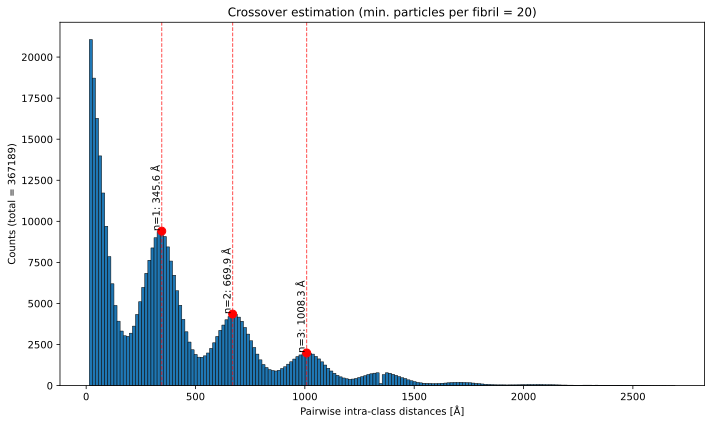
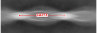

# Crossover Distance Estimation from Particle Coordinates

A Python tool for estimating helical crossover distances from particle coordinates from RELION Class2D STAR files.

## Overview

This script analyzes particle coordinates from helical filaments to estimate crossover distances by calculating pairwise intra-class distances and identifying periodic peaks in their distribution. It's particularly useful for determining helical parameters of amyloid fibrils and other helical structures.

## Usage

```bash
python ./sl_crossover_from_coords.py example_2dclass_data/particles.star 0.82
```

### Required Arguments

- `particle_star`: Path to input particle STAR file containing metadata about 2D classified helical segments. They should be from one polymorph only and can be selected via the RELION Select job.
- `angpix_mic`: Pixel size in Ångströms of the micrographs from which particles were extracted

### Optional Arguments

- `--min-particles N`: Minimum number of particles per fibril (default: 20). Fibrils with fewer particles are disregarded
- `--prominence FRAC`: Peak prominence threshold as fraction of maximum count (default: 0.05 = 5%)

## Dependencies

- numpy
- matplotlib
- pandas
- starfile
- seaborn
- scipy

## Output

The script generates:

1. **Histogram plot** showing the distribution of pairwise intra-class distances with detected peaks
2. **Console output** with:
   - Detected peak positions (in Ångströms)
   - Estimated crossover distance (from first non-zero peak)
   - Calculated helical twist angle (assuming 4.75 Å cross-beta spacing)

### Example Output



The plot shows detected peaks at multiples of the crossover distance, marked with red dashed lines and labeled with their distance values. For the example 2D classes of an Aβ42 Type2 polymorph, which has and addmittly obvious crossover distance the first peak correspondes to the distance measured manually in one class average.




## How It Works

1. Reads particle coordinates and metadata from RELION STAR file
2. Groups particles by filament and class
3. Calculates all pairwise distances between particles of the same class within each filament
4. Creates a histogram of these distances
5. Detects peaks in the histogram using configurable prominence threshold
6. Estimates crossover distance from the first detected peak
7. Calculates corresponding helical twist angle

## Output Files

The script saves the histogram plot as:
- `Inter_class_distance_histogram_ths{N}.svg` (where N is the min-particles threshold)

Files are saved both in the current directory and in the same directory as the input STAR file.
